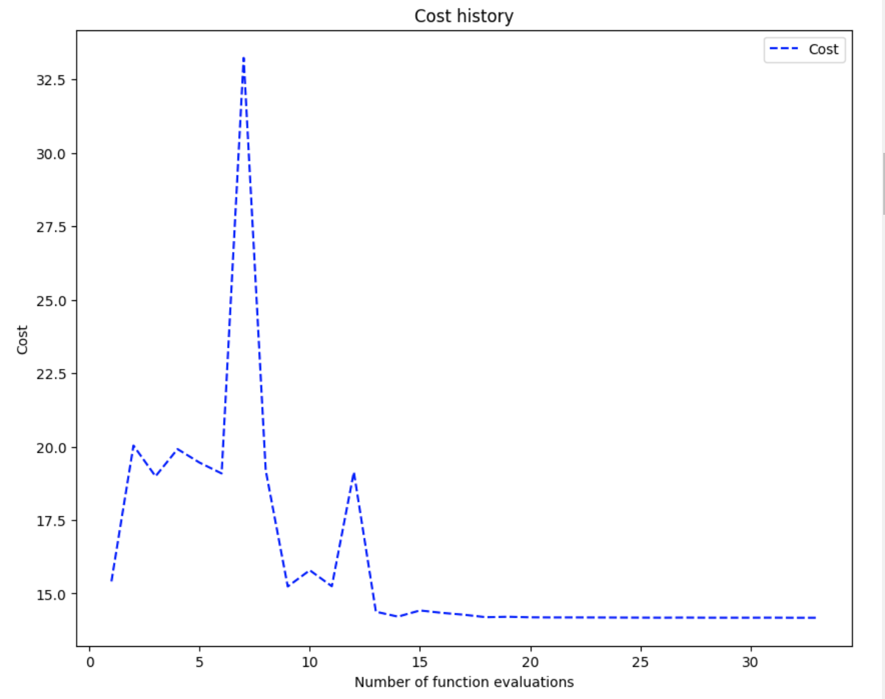

# Making sense of the result

You have just ran the simples QAOA workflow and now it is time to make sense of what just happened. 

```Python
from openqaoa import QAOA  

q = QAOA()
q.compile(qubo_problem)
q.optimize()
```

A QAOA workflow is composed by 4 parts. this example, we have used the default values:

* **the circuit ansats** a 1-layer qaoa, with the `standard` parametrisation and the `x` mixer
* **the classical optimizer** `cobyla`, as implemented by the folks at SciPy
* **the device employed** `vectorized`, a very fast numpy-based QAOA simulator developed by Entropica Labs
* **the result of the algorithm**

## The result object

Result is a class attribute of the object `q`, and its chief role is that of keeping a record of the steps behind the workflow.

In particular, there are three pain attributes of the result object:

### The optimized result

Evaluating

```Python
q.result.optimized
```

yields

```JSON
{'angles': [0.35361247886982217, 0.383757626934605],
 'cost': 14.175868570032316,
 'measurement_outcomes': array([ 0.01401859-0.05426676j,  0.01930903-0.05959513j,
         0.01930903-0.05959513j,  0.06267756+0.02087j   ,
         ...,
         0.05136043-0.02452211j,  0.1342158 -0.01110605j]),
 'job_id': 'db3e0180-9bd7-40c8-b1a4-91d6d08e1ec8',
 'eval_number': 32}
```

Let's unpack it:

* **angles** : these are the optimized ${\gamma, \beta}$. we have only 2, because when the number of layers is 1 (that is, `p=1`) and the parametrization is standard we obtain (that is, `param_type=standard`) we have just two parameters.
* **cost** :  this is the cost value obtained when the angles are plugged into the cost function.
* **measurement_outcomes** : represent either the wavefunction or the measurement count for the optimized state. In this case we used a wavefunction simulator, and the `measurement_outcomes` corresponds to a $2^n$ complex numbers. 
* **job_id** :  the job id representing the optimized measurement outcomes. This is the job id returned by the cloud provider, if a QOU was used.
* **eval_number** : identify the index of the optimized state with respect to all the intermediate results stored in the optimization loop


### The intermediate result

Evaluating

```Python
q.result.intermediate
```

yields

```JSON
{'angles': [[0.35, 0.35],
  ...,
 [0.3540879842708628, 0.38463733973636544]],
 'cost': [15.412157445012767,
 ...,
 14.176027938975054],
 'measurement_outcomes': [],
 'job_id': ['e65d41ee-1775-46b8-abcb-4764949da1ea',
  ...,
  '5c80c9f8-02d0-45be-8c50-bd4e93b54c3b']}
```

Let's unpack it:

* **angles** : these are the ${\gamma, \beta}$ belonging to the i-th intermediate result within the optimization loop
* **cost** :  the list of costs recorded during the optimization
* **measurement_outcomes** :  the (empty) list of measurement outcomes. Recording all the intermediate results is switched off by default
* **job_id** :  the list of job_ids corresponding to each cost evaluation


### Plotting the cost function

OpenQAOA features some helper function to extract some common plots 

```Python
q.result.plot_cost()
```



Indeed, from the plot we can see that:

1. The lowest cost was around the value of 14,
2. The optimizer stopped after around 30 iterations